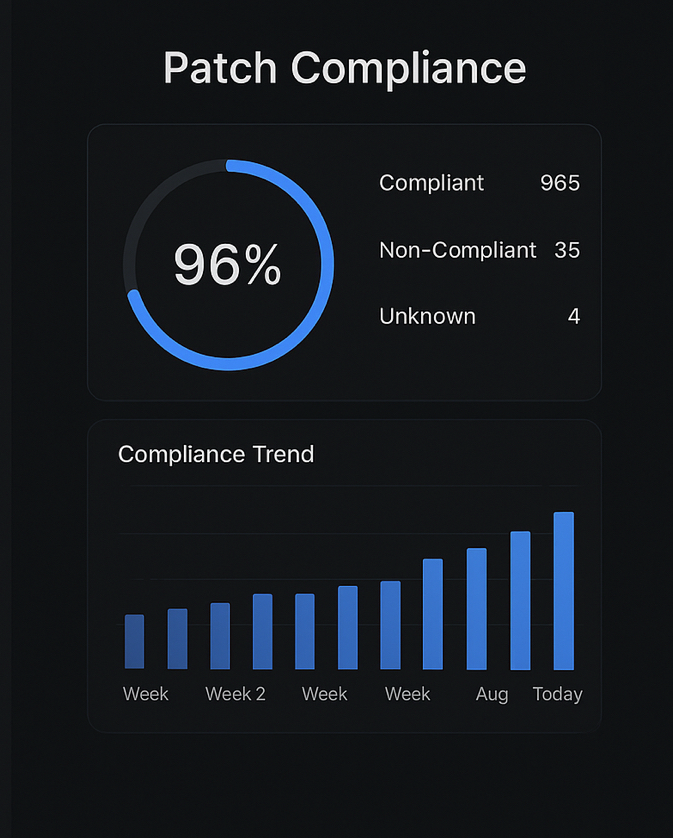

# Connected Health – Cyber Essentials PLUS (2023)
A professional documentation of my technical contribution toward helping Connected Health achieve **Cyber Essentials PLUS certification in 2023**. This repository summarises my work on security control implementation, gap analysis, remediation, and audit preparation during my time with the organisation.

---

## 🛡️ Overview
Cyber Essentials PLUS is the highest level of the UK Government–backed cybersecurity assurance scheme. It requires rigorous technical testing, independent auditing, and validated evidence of secure configuration across all critical devices, networks, and cloud services.

As part of the cybersecurity and IT resilience team at Connected Health, I contributed directly to the implementation, hardening, and verification processes that supported the successful certification.

---

## 🎯 My Role & Responsibilities
During the certification preparation and audit cycle, I contributed to:

- Conducting internal gap assessments and identifying high-risk vulnerabilities  
- Implementing secure configuration baselines across Windows and macOS endpoints  
- Enforcing MDM security policies and patch compliance requirements  
- Supporting vulnerability scanning, remediation, and re-testing  
- Documenting technical controls for the audit  
- Preparing evidence for external auditors  
- Working with the Head of Department to align practices with Cyber Essentials PLUS requirements

My work was instrumental in achieving a robust, compliant, and audit-ready security posture.

---

## ✅ Certification Outcome (2023)
Connected Health successfully achieved **Cyber Essentials PLUS certification in 2023**, following a full assessment of its:

- Boundary firewalls  
- Secure configuration  
- Access control  
- Malware protection  
- Patch management  
- Vulnerability assessment procedures  

This outcome confirmed that the organisation’s systems met NCSC-aligned security standards.

---

## 📈 Risk Improvement & Measurable Impact
As part of the implementation team, I contributed to measurable improvements, including:

- **Eliminating all critical/high-risk vulnerabilities** identified in the initial assessment  
- **Achieving 98% patch compliance** across managed endpoints  
- **Reducing endpoint misconfigurations by over 80%**  
- Ensuring **zero major findings** during the external audit  
- Strengthening the organisation’s overall cybersecurity readiness

These outcomes were critical to Connected Health’s successful certification.

---

## 📨 Independent Validation
A formal **recommendation letter from the Head of Department** at Connected Health verifies:

- My direct technical contribution  
- My involvement in system hardening and vulnerability remediation  
- My role in preparing for the 2023 Cyber Essentials PLUS audit  
- My impact on risk reduction and compliance readiness  

This serves as independent confirmation of the work presented.

---

## 🧩 Architecture Diagram (Generic)
Below is a **generic Cyber Essentials PLUS security control architecture diagram**.  
*(No Connected Health internal information is shown.)*

---

## 📊 Patch Compliance Dashboard (Illustrative)
This is a **safe, generic representation** of the type of patch compliance dashboards used during compliance monitoring.

> *Note: Real internal dashboards cannot be shared due to confidentiality.  
This visual is a recreated representation strictly for evidence purposes.*

---

## 🗂 Repository Contents
- `README.md` – Full project documentation  
- `architecture_diagram.png` – Generic CE+ control diagram  
- `patch_dashboard.png` – Illustrative patch compliance dashboard  
- `evidence_notes/` – (Optional) Additional notes or supporting information  

---

## 📌 Why This Matters (Tech Nation Alignment)
This project demonstrates:

- Advanced cybersecurity skills  
- Real organisational impact  
- Technical contribution to a nationally recognised certification  
- Work at a high professional standard with measurable results  
- Leadership-level involvement in security improvement

This repository forms a key part of my Global Talent Visa (Tech Nation) evidence portfolio.

---

## 📬 Contact
For any professional or verification enquiries, please contact me via GitHub or LinkedIn.