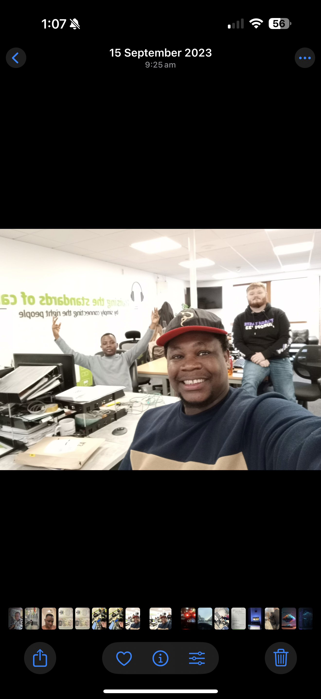

# Cyber Essentials PLUS – Technical Contribution at Connected Health

This repository documents my **technical contribution to helping Connected Health (Belfast) achieve Cyber Essentials PLUS certification**.

It includes:

- A written evidence document (PDF) used in my UK Global Talent application
- Screenshots showing management recognition
- Photos from the technical operations environment
- Proof of my integration in the organisation

---

## 1. Context

**Organisation:** Connected Health, Belfast, Northern Ireland  
**Role:** IT / Technical Support – Cyber Essentials project contributor  
**Certification:** Cyber Essentials PLUS (UK Government–backed cyber security scheme)

Connected Health is a large domiciliary care provider handling sensitive personal and health data. Achieving Cyber Essentials PLUS was an important step in improving security posture and meeting UK expectations for cyber hygiene.

---

## 2. My Contribution

As part of the internal technical team, I contributed to:

### Device & Endpoint Security

- Auditing staff laptops and devices
- Confirming antivirus installation and update status
- Verifying operating system patch levels
- Checking firewall settings and inbound-blocking rules
- Supporting drive encryption and secure configuration

### User Access & Authentication

- Reviewing user account permissions and access levels
- Supporting the rollout of multi-factor authentication (MFA)
- Ensuring remote access followed Cyber Essentials guidelines

### Documentation & Evidence for the Assessor

- Gathering screenshots and logs for the external assessor
- Updating device-compliance spreadsheets
- Responding to follow-up questions from management and auditors
- Helping to explain technical details of the configuration changes

These activities mapped directly to the five Cyber Essentials control areas:

1. Firewalls & routers  
2. Secure configuration  
3. User access control  
4. Malware protection  
5. Security update management  

---

## 3. Recognition from Management

As a thank you for my work, I received a personal card and gift from Connected Health management.

> “Thank you for your hard work + dedication towards achieving our cyber essentials plus certification!  
> Congratulations! – Rebecca”

This informal but powerful recognition shows that my contribution was visible and valued inside the organisation.

---

## 4. Technical Team & Workspace

I worked as part of the technical operations team, based in the Connected Health office.

The photo above shows me with colleagues in the technical workspace where we carried out:

- Device configuration checks  
- MFA setup support  
- Network and endpoint testing

The workspace image illustrates the environment used for hardware checks, system configuration and audit preparation.

---

## 5. Company Event & Integration

I was also invited to internal Connected Health events, confirming my role within the organisation.

This name card from a Connected Health event shows my full name and the company branding, linking me clearly to the organisation.

---

## 6. Evidence Document (PDF)

The full 2–3 page evidence document used in my UK Global Talent application is included here:

**Evidence 5 – Cyber Essentials Technical Contribution (Ibrahim Akinyera)**  
`Evidence_5_Cyber_Essentials_Ibrahim_Akinyera.pdf`

It summarises:

- The Cyber Essentials PLUS context  
- My technical responsibilities  
- The outcome (successful certification)  
- How this work supports my Global Talent “Optional – Recognition” criterion  

---

## 7. Relevance to UK Global Talent (Tech)

This work demonstrates that I have:

- Delivered **real-world, security-sensitive technical work** in a UK organisation  
- Contributed directly to a **nationally recognised security certification**  
- Been **recognised by management** for my effort and expertise  

It forms one of my supporting evidences under the **Optional Criterion: recognition for work outside of normal duties / significant technical contribution**.